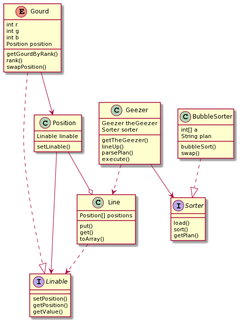
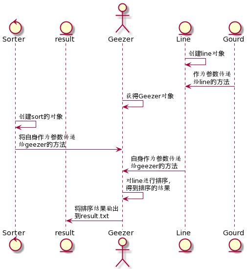

#### 1、类图和时序图
example类图：若图片无法显示，可查看uml文件夹下的character_1.png和character.pu
     
对象时序图：若图片无法显示，可查看uml文件夹下的timeline_1.png和timeline.pu
    
#### 2、设计理念的好处和改进之处
    本次作业的核心内容是实现一个排序算法，并将排序结果可视化出来，所以当不站在面向对象的角度的时候，只需要一类和几个方法即可完成，但是从理解性上来讲，就不如面向对象的这种设计好。
###### 1）、Sorter接口：
    在example中，注重的不再是sort方法的实现过程，而是将概念抽象出来，让这些概念之间进行交互。例如创建了一个Sorter接口，在接口中存在几个需要等待被实现的方法，外部使用这样一个接口的时候不需要去考虑接口的内部是怎样去进行实现的，从而屏蔽了细节，而是专注于逻辑的实现，这是其中一个好处。但是也有不足之处，在这个接口中提供了三个方法，当后面的类实现了这个接口，去重写这些方法的时候，发现其中两个方法在不同的类中是一样的实现，代码变得重复了起来。
###### 2）、Position类和Linable接口及其实现之间的关系：
    阅读代码可以发现，Position类拥有一个成员变量Linable，从理解上说是在一个位置上会占一个可以排序的对象，而从Gourd实现了Linable接口可以看到，在这个position上面占据的就是一个Gourd，这可以看作是Position单方面和Linable接口及其实现类建立了联系；而继续看，Gourd类中也拥有一个成员变量，而这个成员变量则是Position，其实也就是Gourd所占据的Position被记录了下来，从而与Position又建立了联系。也就是建立了双向的联系，这对于不同对象之间的交互是非常方便的。
###### 3）、Linable接口的改进：
    从前面的分析看到，Position拥有一个成员变量，但是这个成员变量却是一个接口，我认为这并不是一个很能够让人接受的地方，单纯从一个接口所能够体现的东西太少了，我认为不足以满足对象之间的交互。所以我认为将这样一个接口改为一个抽象类，对抽象类的某些方法和成员变量进行定义，使其能够拥有一个“可以用来排序的对象所需要拥有的基本特点”，而对于这个抽象类的具体实现，则是具体的类的独有的方法。可以在一定程度上改善Linable接口所造成的“意义不明的情况”。
###### 4）、对Line对象排序：
    代码的本质还是要对一系列变量或者对象进行排序，在使用了面向对象的思路来进行编写代码之后，被排序的本体就变成了一个一个的对象，而不是数组等其他东西，和自然关系更加接近；同时将被实际排序的本体限制在了另一个对象当中，从而从外部来看就是“对某一个地方里面的内容进行排序”，又一次提高了抽象度和加深了对现实世界的模拟